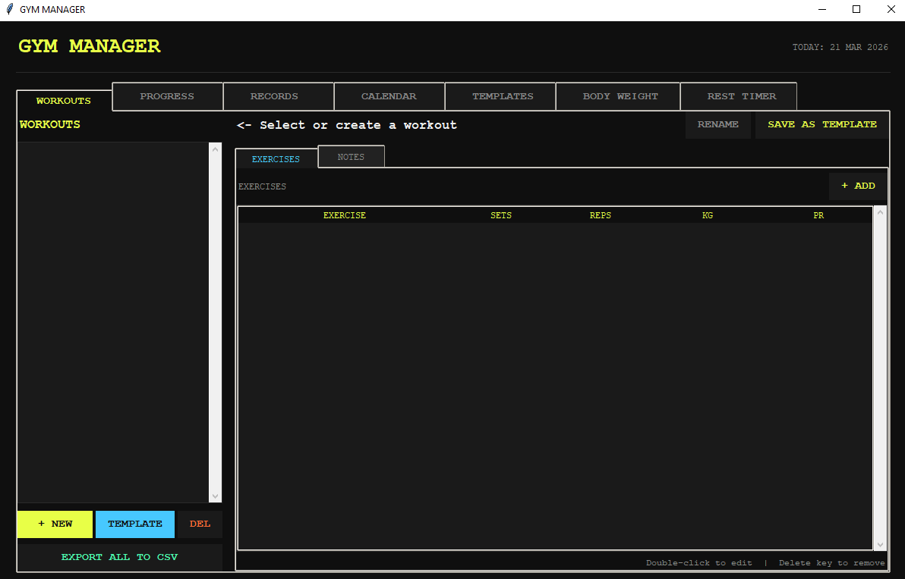

# Gym Manager 🏋️‍♂️📊

A desktop **workout tracking application** built with Python and Tkinter.  
It helps you log workouts, track progress, and analyse gym performance over time.

---

## 📸 Screenshot

---

## 🛠 Features

- 🏋️ Workout logging (sets, reps, weight tracking)
- 📈 Progress tracking with charts over time
- 🏆 Automatic personal record detection per exercise
- 📅 Workout calendar overview
- 📋 Workout templates for fast reuse
- ⚖️ Body weight tracking with history graphs
- ⏱️ Rest timer with presets
- 📤 CSV export for all workout data

---

## 🚀 How to Run

### 1. Clone the repository

git clone https://github.com/Jimoulis31/gym-manager.git
cd gym-manager

### 2. Install dependencies

pip install matplotlib ttkthemes

### 3. Run the application

python GymTrackingApp.py

---

## 📦 File Structure

gym-manager/
├── GymTrackingApp.py
├── README.md
├── images/
│   └── screenshot.png
└── data/   # saved workouts / exports

---

## ⚙️ How It Works

1. User logs workouts via Tkinter GUI
2. Data is stored locally (structured workout logs)
3. Matplotlib generates progress charts
4. System calculates PRs and trends automatically
5. Calendar view visualises training frequency

---

## 💻 Technologies

- Python 3.x
- Tkinter
- Matplotlib
- ttkthemes

---

## ⚡ Future Improvements

- Cloud sync for workouts
- Exercise database with suggestions
- Mobile companion app
- More advanced analytics (volume, fatigue tracking)
- Social sharing / leaderboard system

---

## 📧 Contact

Created by **Jimoulis31**
